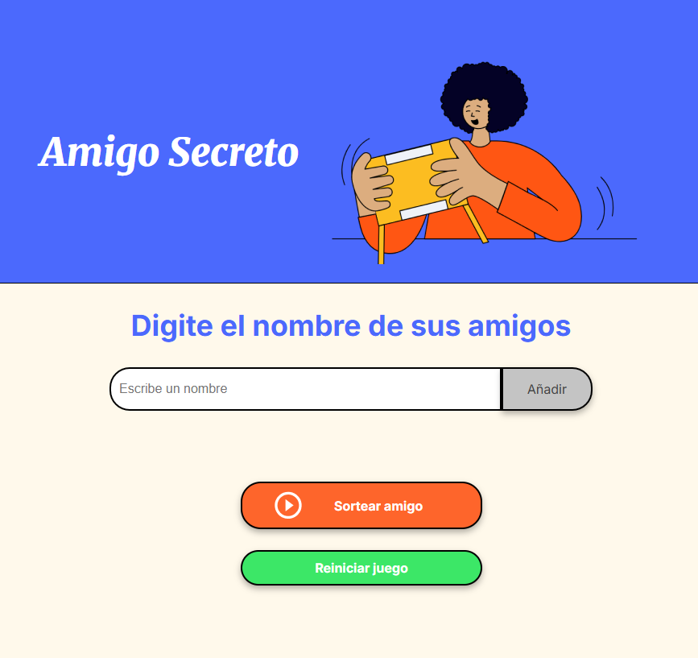

# Challenge Amigo Secreto

Proyecto realizado como challenge de programación.  
Consiste en una aplicación web que permite ingresar nombres de amigos, mostrar la lista y sortear aleatoriamente quién será el **amigo secreto**.  



---

## Funcionalidades:

- **Añadir amigos**: Ingresa nombres de amigos para incluirlos en el sorteo.
- **Mostrar lista**: Visualiza todos los amigos añadidos.
- **Sortear amigo secreto**: Realiza un sorteo aleatorio para asignar a cada participante su amigo secreto.
- **Reiniciar juego**: Borra la lista y el resultado para comenzar de nuevo.

---

## Tecnologías utilizadas:

- **HTML5**: Estructura básica de la página.
- **CSS3**: Estilos y diseño responsivo.
- **JavaScript**: Lógica para agregar amigos, sortear y reiniciar el juego.

---

## Estructura del proyecto:

```
📦 amigo-secreto
 ┣ 📂 assets
 ┃ ┗ amigo-secreto.png
 ┃ ┗ juego.png
 ┣ 📜 index.html
 ┣ 📜 style.css
 ┗ 📜 app.js
```

---

## Uso:

1. Abrir `index.html` en el navegador.
2. Escribir un nombre en el campo de texto y presionar **Añadir**.
3. Una vez cargados los nombres, presionar **Sortear amigo**.
4. El resultado se muestra en pantalla.
5. Para volver a empezar, presionar **Reiniciar juego**.

---

## Instalación:

1. Clona este repositorio en tu máquina local:
   ```bash
   git clone https://github.com/tuusuario/amigo-secreto.git
   ```
2. Abre el archivo `index.html` en tu navegador para comenzar a jugar.

---

